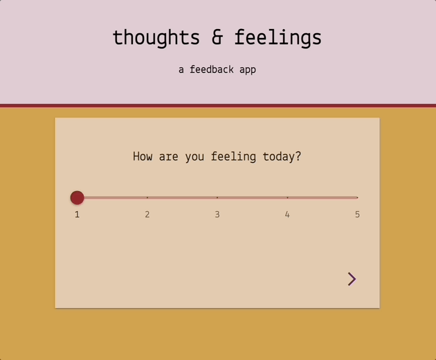
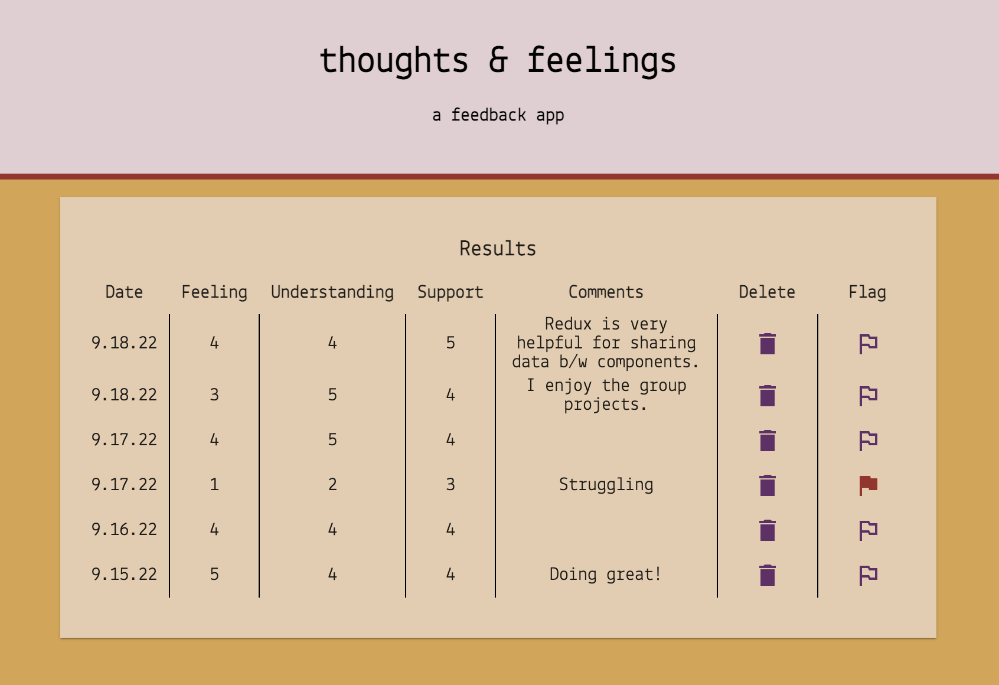

# thoughts & feelings 

## Description

thoughts & feelings is a feedback app built with React.js and Redux to collect user input over four views. Submitted feedback is stored in a database and displayed on an admin page where it can be flagged or deleted.

## Demo

    

## Admin View

### Prerequisites

- [Node.js](https://nodejs.org/en/)
- [Nodemon](https://www.npmjs.com/package/nodemon)
- [PostgreSQL](https://www.postgresql.org/)

## Installation

1. Create a database named `prime_feedback` and execute the query from `data.sql` to create the `feedback` table. 
2. Within your code editor, open a terminal window and install the dependencies by running:
    - `npm install`
3. Run `npm run server` in one terminal window. Open a second terminal window, and run `npm run client`. Access the application at `localhost:3000/#/` in the browser.

## Usage

1. Use the slider to select a feedback value from 1 to 5. Click the arrow on the right to proceed to the next part of the form. 
2. Type into the text area to provide optional comments. Click the arrow on the right to proceed to the review page.
3. Review the entered values. Click the arrow on the left to go back and edit a value or comments. Click the send icon to submit feedback. 
4. Click the pencil to leave more feeedback. You'll be routed back to `localhost:3000/#/`.
5. Access submitted feedback at the admin page: `localhost:3000/#/admin`. Feedback can be toggled between flagged and unflagged by clicking the flag icon. The flag will be outlined purple by default. The flag will turn solid red when the record is flagged. Click the trash icon to delete a record. You will be prompted to confirm before deleting a record.   

## Built With

React.js | Redux | Material UI | Axios | PostgreSQL | Node.js | Express